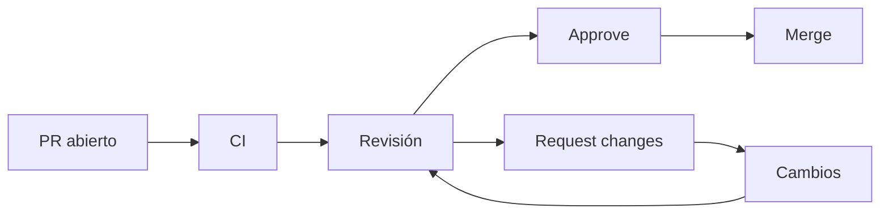

# Guía de code review

## Qué revisamos

- **Corrección**: ¿la lógica hace lo que promete?
- **Alcance**: ¿el PR cambia solo lo necesario?
- **Legibilidad**: ¿se entiende el código sin esfuerzo?
- **Arquitectura**: ¿respeta la estructura del proyecto?
- **Tests**: ¿hay cobertura del cambio?
- **Documentación**: ¿se actualizó si hace falta?
- **Seguridad**: ¿se evitan riesgos obvios (cuando aplica)?

## Los tres veredictos

| Veredicto | Cuándo usarlo |
| --------- | ------------- |
| **Comment** | Aportación, duda o sugerencia que no bloquea el merge. |
| **Approve** | El PR está correcto y puede integrarse. |
| **Request changes** | Hay errores que deben corregirse antes del merge. |

## Comentarios bloqueantes vs no bloqueantes

- **Bloqueante**: un error real o una decisión que rompe algo. El PR
  no debería integrarse hasta resolverlo.
- **No bloqueante**: una sugerencia de estilo o una mejora futura.
  Se puede integrar igual.

Indica explícitamente el tipo de cada comentario, por ejemplo:

> (Bloqueante) Aquí el estado pendiente nunca se actualiza a confirmada.

> (No bloqueante) Podríamos extraer esta lógica a una función, pero no es urgente.

## Consejos

- Sé concreto: cita la línea y propón una alternativa.
- Sé respetuoso: se revisa código, no personas.
- Antes de aprobar, verifica que CI esté en verde.
- En este taller, no apruebes tu propio PR.

## Flujo de revisión

