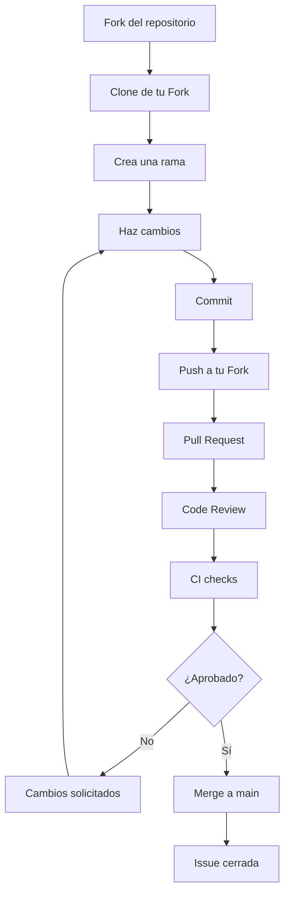

# Flujo de trabajo de GitHub

## El flujo completo



## origin y upstream

| Remoto | Qué es | Ejemplo |
| ------ | ------ | ------- |
| `origin` | Tu **Fork** personal | `https://github.com/tu-usuario/github-workflow-workshop.git` |
| `upstream` | El **repositorio original** del taller | `https://github.com/organizacion/github-workflow-workshop.git` |

Agregar `upstream`:

```bash
git remote add upstream https://github.com/<organizacion>/github-workflow-workshop.git
```

Verifica los remotos con:

```bash
git remote -v
```

## Mantener tu Fork sincronizado

Cuando el repositorio original avanza, tu Fork se queda atrás. Sincroniza:

```bash
git fetch upstream
git switch main
git merge upstream/main
git push origin main
```

`git fetch upstream` trae las novedades del original sin tocarlas;
`git merge upstream/main` integra esas novedades en tu `main` local.

Consejo: sincroniza antes de crear cada nueva rama.

## Ramas

Cada equipo usa sus propias convenciones. En este taller recomendamos:

| Prefijo | Uso | Ejemplo |
| ------- | --- | ------- |
| `feature/` | Nueva funcionalidad | `feature/movie-rating` |
| `fix/` | Corrección de errores | `fix/sidebar-responsive` |
| `chore/` | Tareas de mantenimiento | `chore/update-deps` |
| `docs/` | Documentación | `docs/setup` |

Usa nombres cortos y descriptivos. Crea la rama desde un `main` actualizado:

```bash
git switch main
git fetch upstream
git merge upstream/main
git checkout -b feature/movie-rating
```

## Pull Request

El PR se abre desde tu rama en el Fork hacia `upstream/main`:

```
tu-usuario:feature/movie-rating → organizacion:main
```

Usa la plantilla incluida en `.github/pull_request_template.md`.

## CI checks

Cada PR contra `main` ejecuta automáticamente GitHub Actions:

1. Instala dependencias (`npm ci`)
2. Compila el proyecto (`npm run build`)
3. Ejecuta los tests (`npm test`)

Si un check falla, el PR no se puede aprobar. Corrige y vuelve a hacer push.

## Protección de `main`

Se recomienda proteger `main` en **Settings → Branches → Add rule**:

- [x] Require a pull request before merging
- [x] Require approvals (al menos 1)
- [x] Require status checks (el workflow `CI`)
- [x] Require conversation resolution
- [x] Do not allow bypassing the above settings
- [x] Block force pushes

Estas reglas garantizan que todo lo que llega a `main` fue revisado y pasó CI.
